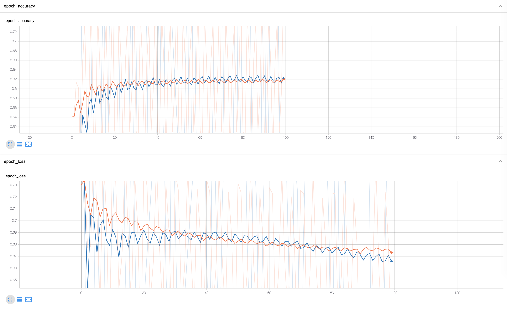
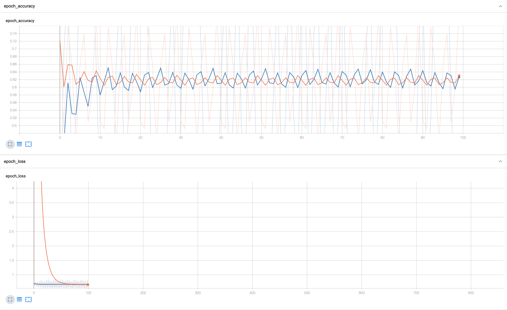

# Emotion Recognition

The goal is to train a neural network with mixed input data(facial features & the img) to classify expressed emotions to test for potential performance improvements. Methods that extract features beforehand are not common in image detection and and actually belong to the methods that should no longer be required in the neural world of image detection. 

The facial features are represented by a point vector, which marks the position of the mouth, nose, cheeks, etc., face structure in general.
The raw model composes of a slightly adopted VGG16 which is simply trained with the images as input and the lables as output.
The mixed model is made up of three networks being the VGG16(for the raw images) and MPL(for the vecotrized facial features) model which are concatenated to one mixed input model with only two fully connected layer + softmax at the end.

Raw:

Image with facial features visually marked:

## Results

The models have been tested on a simplified dataset which is split in two classes, `happy`and `sad`.
Both models were trained with the same tuning parameters (epochs, batch size, learning rate, validation training ratio).

#### Mixed data model results

happy: 0.6304458  
sad: 0.36955425

#### Raw data(only VGG16) model results

happy: 0.6271563  
sad: 0.37284365

## Résumé

The improvements achieved by labeling the facial features beforehand and training with a mixed input model are *minimal* and don't make a significant difference that would justify the additional effort. The project shows how good the convolutional network and the kernal process is in detecting important key areas/changes in an image to an extant that it can keep up with static facial feature detection(labeling).

## Setup

- Download the dataset from [here](https://www.b-tu.de/en/graphic-systems/databases/the-large-mpi-facial-expression-database). (You don't need to download all sets one is sufficient)

- Create the raw dataset by running. (`dataSetDir`(input) and `files`(output) variables need to be set to the correct path)  
      - `python create_dataset.py`

- Run label_data.py to create the dataset with facial features detected (`dataSetDir`(input) and `files`(output) variables need to be set to the correct path) 
      - `python label_data.py`

- Train the data on raw and trained and compare the results 
      - `python train_raw.py`  
      - `python train_mixed.py`

## Requirements

- numpy
- dlib
- pickle
- cv2
- tqdm
- imutils
- keras
- tensorflow
- collections
- sklearn

## Face recognition/ detection

The face detection in the dataset creation utalizes the standard OpenCv face detection.
The landmark(facial feature) detection for data labeling is done with [DLib](http://dlib.net/)

    detector = dlib.get_frontal_face_detector()

## Dataset

The requirements for the dataset are rather special because the recordings need to hace a certain resolution and quality. That's the reason why most common datasets are out of the question. The [MPI Facial Expression Database](https://www.b-tu.de/en/graphic-systems/databases/the-large-mpi-facial-expression-database) consists of 64 classes.
