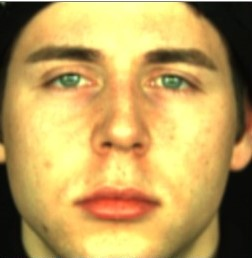
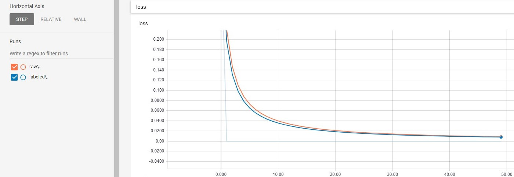

# Emotion Recognition

The goal is to get an idea of the improvement done by datasets in which the image data is additionally labeled with markers on eyes, mouth, etc., marked with dlib.

Raw:

Labeled:

### Results

The results show a 15% decrease in loss which is not much considering the amount of time that went into labeling, but is still worth thinking about if it's easy to create those extra lables (markers)

## Setup

- Download the dataset from [here](https://www.b-tu.de/en/graphic-systems/databases/the-large-mpi-facial-expression-database). (You don't need to download all sets)

- Create the raw dataset by running
      python create_dataset.py

- Run label_data.py to create the labeled dataset
      python label_data.py

- Train the data on raw and trained and compare the results
      python train_labeled/raw.py

## Requirements

- numpy
- dlib
- pickle
- cv2
- tqdm
- imutils
- keras
- tensorflow
- collections
- sklearn

## Face recognition/ detection

The recognition and landmark detection for data labeling is done by [DLib](http://dlib.net/)

    detector = dlib.get_frontal_face_detector()

## Dataset

The requirements for the dataset are rather special because the recordings need to hace a certain resolution and quality. That's the reason why most common datasets are out of the question. The [MPI Facial Expression Database](https://www.b-tu.de/en/graphic-systems/databases/the-large-mpi-facial-expression-database) consists of 64 classes.
